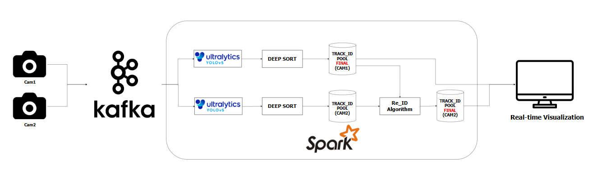

# Vehicle Re-Identification System in Vietnam using YOLO, DeepSORT, and Spark Streaming

A multi-camera vehicle detection and re-identification system built on YOLO, DeepSORT. In order to implement this system in real-time, we use Kafka for sending and receiving data then use Pyspark to run the multi-camera Re-id system.

This is our pipeline


## Requirements

- Python 3.10+
- CUDA 12.6
- PyTorch 2.7.1
- Apache Spark 3.5.6
- Kafka 2.12
- Scalar 3.9.1

## Running the System
Clone the repository
```bash
git clone https://github.com/MaPhat/Ds201-Re-identification-.git
cd Ds201-Re-identification
```

# To run only the system in your local machine
```bash
python main.py
```

# For running only the system in streaming data

Start Kafka server
```bash
bin\windows\zookeeper-server-start.bat config\zookeeper.properties

bin\windows\kafka-server-start.bat config\server.properties
```

Start Spark Streaming App
```bash
python producer_cam1.py
python producer_cam2.py

python app_pyspark.py
```
Please refer to Section 4.3: Experimental Results in our report for more details about our findings.

## Demo
Please access to this link to watch our demo.
https://drive.google.com/drive/folders/1ASVPloYXNK2_i8cMARJ3Wk-EInAWTGqK?usp=sharing

## Authors
Phát Mã Kim, Nguyên Đặng Chí, Mộng Thúy Đường Thị

Data Science Student @ UIT - VNUHCM

Contact: {22521071,22520963,22521454}@gm.uit.edu.vn
